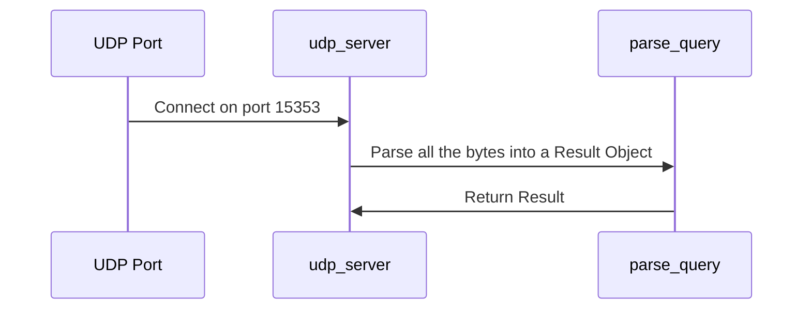

# Processing Packets

UDP Flow

```mermaid
sequenceDiagram
    participant udpport as UDP Port
    participant udpserver as udp_server
    participant parsequery as parse_query
    udpport->>udpserver: Connect on port 15353
    udpserver->>parsequery: Parse all the bytes into a Result Object
    parsequery->>udpserver: Return Result
    
```
