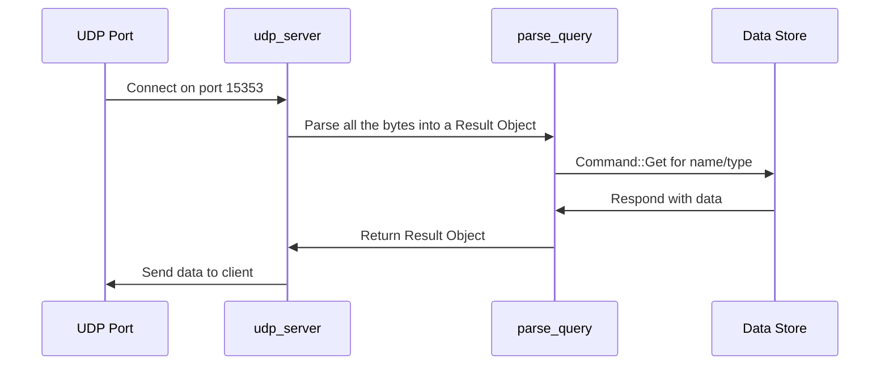

# Processing Packets

UDP Flow

```mermaid
sequenceDiagram
    participant udpport as UDP Port
    participant udpserver as udp_server
    participant parsequery as parse_query
    participant datastore as Data Store
    udpport->>udpserver: Connect on port 15353
    udpserver->>parsequery: Parse all the bytes into a Result Object
    parsequery->>datastore: Command::Get for name/type
    datastore->>parsequery: Respond with data
    parsequery->>udpserver: Return Result Object
    udpserver->>udpport: Send data to client
    
```
