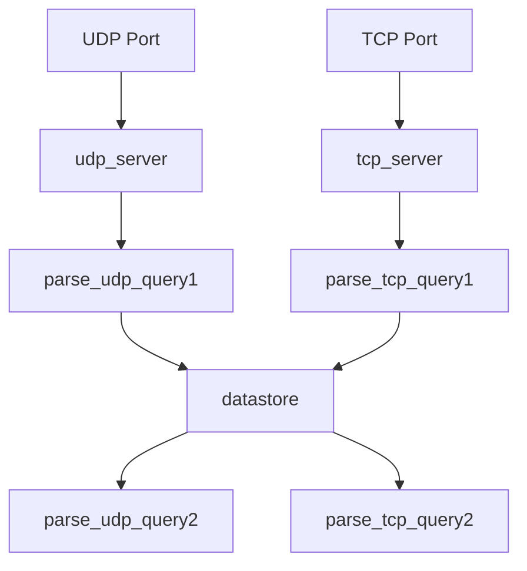

# Processing Packets

```mermaid
graph TD;
    tcpport[TCP Port]-->tcpserver[tcp_server];
    tcpserver-->parse_tcp_query1;
    
    udpport[UDP Port]-->udpserver[udp_server];
    udpserver-->parse_udp_query1;

    parse_udp_query1-->datastore;
    parse_tcp_query1-->datastore;
    datastore-->parse_udp_query2;
    datastore-->parse_tcp_query2;
```
